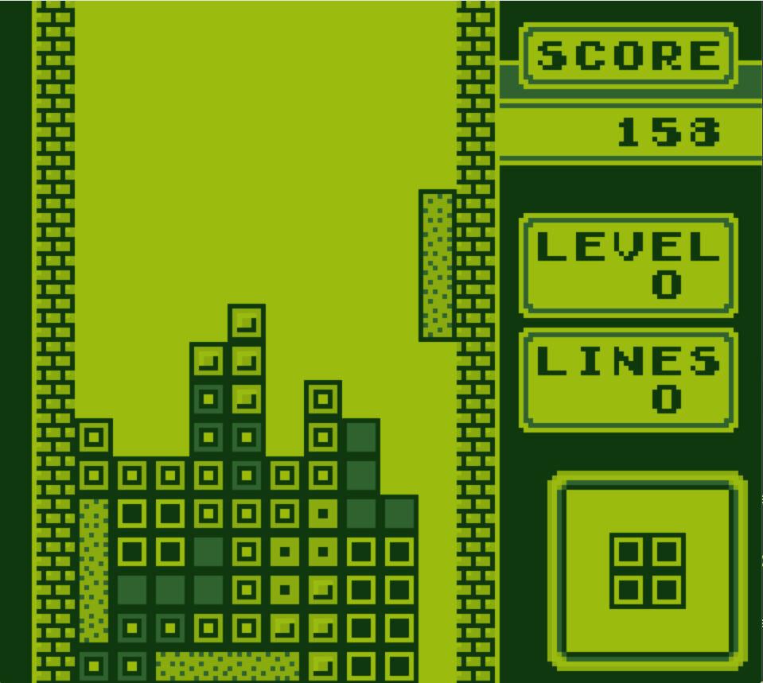
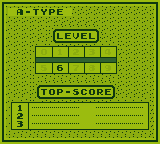
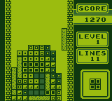
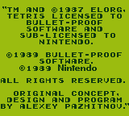

# GBEmu — Game Boy (DMG) Emulator

A Nintendo Game Boy (DMG) emulator written from scratch in modern C++ (C++20). Every subsystem — the Sharp SM83 CPU, the memory bus, the interrupt controller, the timer, and the pixel-processing unit (PPU) — was implemented by hand and validated against hardware test ROMs. It runs commercial games at full speed.



| Level Select | Gameplay | Credits |
|--------------|----------|---------|
|  |  |  |

## Highlights

- **Hand-written SM83 CPU** — all ~500 base and CB-prefixed opcodes, implemented by hand and passing the full Blargg `cpu_instrs` suite.
- **Cycle-driven design** — the timer, interrupt servicing, and the scanline-timed PPU all advance off the CPU's cycle count each step, keeping the subsystems in sync the way the real hardware does.
- **Complete graphics pipeline** — the Game Boy tile/tilemap system, background rendering with scrolling, sprite (OBJ) rendering with flipping and per-object palettes, and OAM DMA.
- **Real-time SDL2 front-end** — a live window with keyboard input, running Tetris interactively.
- **Portable core** — the emulator core has no platform dependencies; all platform I/O (display, input, ROM loading) lives in a thin outer layer, by design, to enable a future microcontroller (ESP32) port.

## Architecture

The machine is a set of independent components wired together at a single composition root, `GameBoy`, which owns every component by value and injects dependencies through constructors. The `Bus` is a **pure address router**: it holds no memory of its own and forwards each read/write to whichever component owns that address range. Every component owns its own address logic — the bus just routes.

Emulation advances through `GameBoy::step()`, which drives the whole system off the CPU's cycle count:

```cpp
int cycles = _cpu.step();
if (_timer.tick(cycles)) requestInterrupt(2);   // timer overflow -> interrupt
uint8_t ppuIrq = _ppu.tick(cycles);             // advance the LCD
if (ppuIrq & 0x01) requestInterrupt(0);         // VBlank
```

Components signal interrupts upward; `GameBoy` sets the corresponding `IF` bit. This one-directional flow (components never reach back into `GameBoy`) is what keeps the core decoupled and portable.

**Components:** `CPU`, `Bus`, `Cartridge`, `WRAM`, `HRAM`, `VRAM`, `OAM`, `IORegisters`, `IERegister`, `Timer`, `PPU`, `Joypad`.

## Subsystems

**CPU (SM83).** A complete interpreter for the Game Boy's Sharp SM83 core: registers exposed through a getter/setter interface, flag helpers, `fetch`/`push`/`pop` primitives, and opcode dispatch via `switch` in `execute()` / `executeCB()`. All base and CB-prefixed instructions are implemented.

**Interrupts.** A full interrupt controller — `IME`/`IE`/`IF` with correct priority, the one-instruction `EI` enable delay, and `HALT` wake behavior independent of `IME` — passing Blargg's interrupt test. VBlank and timer interrupts are wired through the shared `requestInterrupt` mechanism.

**Timer.** `DIV`/`TIMA`/`TMA`/`TAC` with overflow-driven interrupts, ticked off the CPU's cycle count.

**PPU.** The LCD is modeled as a cycle-driven mode state machine — OAM scan → drawing → HBlank across 144 visible lines, then VBlank — over the full 154-line / 70,224-dot frame, raising the VBlank interrupt once per frame. Rendering is **scanline-based**: each visible line is drawn at the end of mode 3 from the background tilemap (both tile-data addressing modes, `SCX`/`SCY` scrolling with 256-pixel wrap) and then overlaid with the sprites intersecting that line. A hand-written 2bpp tile decoder underlies both.

**Input.** The joypad register (`0xFF00`) with its two select lines, fed by a platform-agnostic `setButton()` entry point — keyboard events on desktop today, GPIO on the ESP32 later.

## Testing & validation

- **Blargg hardware test ROMs** — the full `cpu_instrs` suite and the interrupt tests pass.
- **Gameboy Doctor** — a logging harness that compares per-instruction CPU state against reference logs, used to validate the CPU during development.
- **Hand-written unit tests** (`main.cpp`) — a `TestSystem` fixture plus targeted checks covering CPU opcodes (loads, ALU ops, DAA, CB-prefixed rotates/bit ops, control flow), interrupt priority and timing, timer overflow, PPU mode-transition timing (`LY`, exactly-one-VBlank-per-frame), the tile decoder, and background rendering. Currently invoked ad hoc by uncommenting calls at the bottom of `main()` during development, rather than wired to a `--test` flag or CTest target.

## Building

Requires CMake (3.20+) and a C++20 compiler. SDL2 is fetched and built automatically via CMake's `FetchContent`, so no separate install is needed.

```bash
cmake -B build
cmake --build build
```

Run a ROM:

```bash
./build/gbemu "path/to/rom.gb"          # Linux/macOS
.\build\Debug\gbemu.exe "path\to\rom.gb"  # Windows (MSVC/Visual Studio generator)
```

> Game ROMs are copyrighted and are **not** included in this repository. Supply your own legally-obtained dump. The freely-redistributable Blargg test ROMs used for validation are in `test_roms/`.

## Controls

| Key | Button |
|-----|--------|
| Arrow keys | D-pad |
| Z | A |
| X | B |
| Enter | Start |
| Backspace | Select |
| S | Save a screenshot |

## Design decisions

A few deliberate engineering tradeoffs, and the reasoning behind them:

- **Scanline renderer over a pixel FIFO.** The PPU draws a whole line at once at the mode 3 → HBlank boundary rather than emulating the hardware's per-dot pixel pipeline. It's far simpler and fully sufficient for background + sprite games like Tetris; a FIFO would only be needed for mid-scanline raster effects.
- **Approximate PPU timing.** The CPU/PPU step at instruction granularity, and mode 3 is fixed at 172 dots. This is an approximation of hardware that actually varies dot-by-dot — a conscious accuracy-for-simplicity trade.
- **VRAM/OAM access locking disabled.** Because the timing above is approximate, strictly blocking CPU access to VRAM/OAM during rendering produced *false positives* that dropped legitimate writes (and corrupted the display). Since no target game depends on being blocked, the locks are deliberately disabled — an accuracy-vs-compatibility decision.
- **OAM DMA is an instant copy, not a timed transfer.** A write to `0xFF46` copies all 160 bytes into OAM immediately rather than over the real 160 M-cycle window, and the CPU isn't restricted to HRAM-only access during the transfer the way real hardware requires. Simpler, and sufficient for every game tested so far — a candidate for tightening up if a game ever depends on the real timing.
- **Platform-isolated core.** No SDL, file, or desktop types appear in the emulator core; the SDL front-end is a replaceable outer layer. This is what makes the planned microcontroller port realistic rather than a rewrite.

## Roadmap

- **Memory Bank Controllers (MBC1/3)** to run games larger than 32 KB.
- **ESP32 port** — the long-term goal: drive a real SPI LCD and physical buttons from the microcontroller, replacing the SDL layer while reusing the emulator core unchanged.

Audio (APU) is intentionally out of scope — the project's focus is the CPU/PPU/memory subsystems and the eventual embedded port, not sound.

## References

- [Pan Docs](https://gbdev.io/pandocs/) — the primary hardware reference.
- [Blargg's test ROMs](https://github.com/retrio/gb-test-roms) — hardware validation.
- [Gameboy Doctor](https://github.com/robert/gameboy-doctor) — CPU state validation.

---

*Built as a systems-programming project — an exercise in emulating real hardware from the documentation up.*
